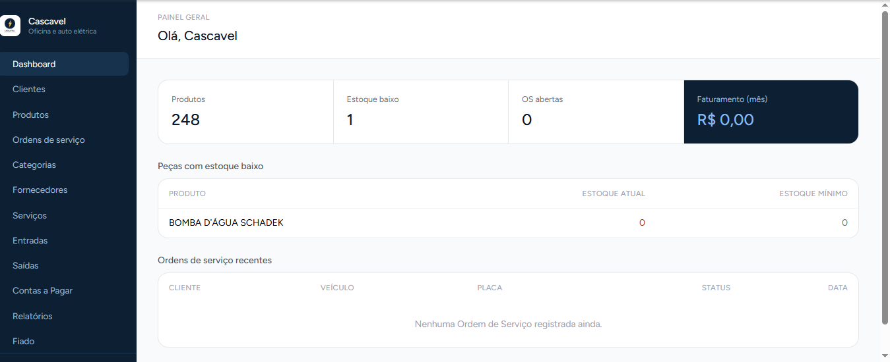
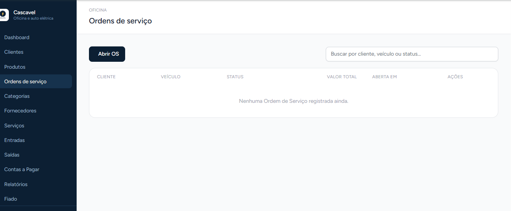
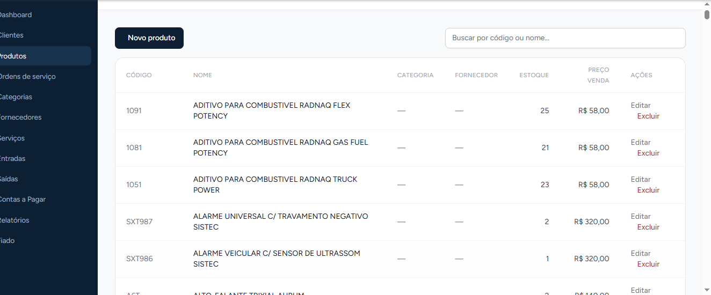
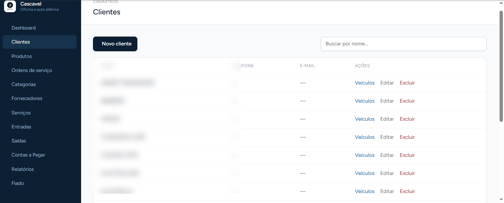
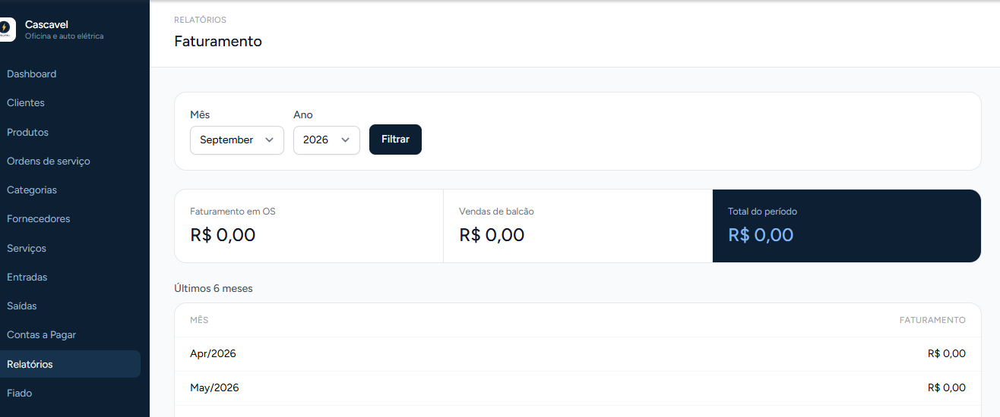

# 🛠️ Sistema de Gestão para Oficina

Sistema web desenvolvido em **PHP e Laravel** para gerenciamento das principais rotinas de uma oficina mecânica.

O projeto foi desenvolvido para uso prático e como projeto de portfólio, reunindo funcionalidades de **ordens de serviço, clientes, veículos, produtos, estoque, serviços e controle financeiro**.

## 👀 Visão geral

O sistema possui uma interface administrativa com módulos separados para as principais operações da oficina.

### 📊 Dashboard



### 🧾 Ordens de Serviço



### 📦 Produtos e Estoque



### 👤 Clientes



### 📈 Relatório de Faturamento



## 🚀 Funcionalidades

- Cadastro e gerenciamento de clientes
- Cadastro de veículos vinculados aos clientes
- Criação e gerenciamento de ordens de serviço
- Cadastro de serviços e mão de obra
- Cadastro de produtos e categorias
- Controle de entrada e saída de estoque
- Cadastro de fornecedores
- Contas a pagar e pagamentos
- Relatórios de faturamento
- Geração de ordens de serviço em PDF
- Autenticação e gerenciamento de usuário
- Regras de negócio para operações do sistema

## 🧰 Tecnologias utilizadas

- **PHP**
- **Laravel 13**
- **MySQL**
- **SQLite** para ambiente local/testes
- **HTML5**
- **CSS3**
- **JavaScript**
- **Blade**
- **Eloquent ORM**
- **Git / GitHub**
- **DomPDF**

## 🏗️ Conceitos aplicados

- Arquitetura MVC
- Rotas e `Route::resource`
- Controllers
- Models e relacionamentos Eloquent
- Migrations
- Validação de dados
- CRUD
- Autenticação e sessões
- Transactions
- Controle de estoque
- Eager Loading
- Regras de negócio
- Geração de PDF

## 📂 Estrutura principal

```text
app/
├── Http/Controllers/
├── Models/
└── ...

database/
├── migrations/
├── factories/
└── seeders/

resources/
├── views/
└── ...

routes/
├── web.php
└── ...

public/

